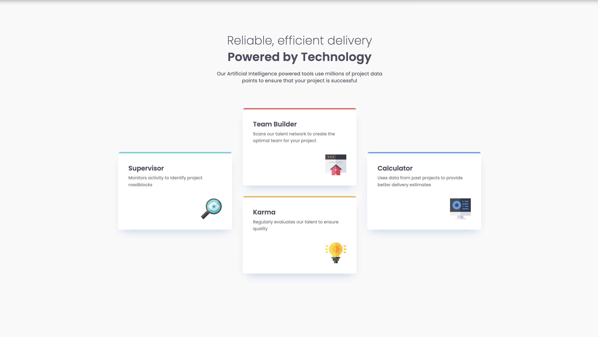

# Four Card Feature Section

A mobile-first, responsive four-card feature section showcasing AI-powered tools with semantic HTML and modern CSS. The layout dynamically adapts from stacked cards on mobile to a unique arrangement on larger screens.
## Screenshots



## Demo

[View Live Project](https://6-four-card-feature-section-kappa.vercel.app/)

## Project Structure

```
/four-card-feature-section
├── assets/
│   ├── images/
│   ├── preview/
├── index.html
├── styles.css
├── README.md
```

## Technologies Used

- HTML5
- CSS3

## Installation & Usage

To run the project locally:

1. Clone the repository:
   ```sh
   git clone https:https://github.com/austin-jonas/6-four-card-feature-section.git
   ```
2. Open index.html in a browser.